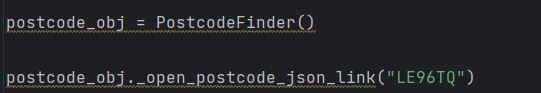
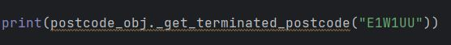
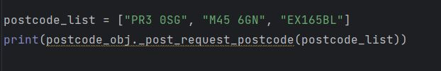
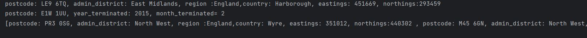

# **API_project**
This project provides the address details and terminated postcodes based in the UK. By using Postcodes.io API we pass on the postcode for fetching the address details.
Postcodes.io is a free postcode lookup API and geocoder for the UK
# Python libraries to run the project:
As we are using API methods with following HTTP[S] endpoint "https://api.postcodes.io" we need *request* library to be installed. 

# How to use the API_project to extract the details
- **API_request_response_file.py:**
  - Using the OOP concept, class *PostcodeFinder()* is created, contains methods to retrieve address details and terminated postcode details.
- **Functions/methods to retrieve details:**
  - **_open_postcode_json_link(postcode):** 
  1) input: postcode e.g. "LE96TQ"
  
  2) output: **postcode: LE9 6TQ, admin_district: East Midlands, region :England,country: Harborough, eastings: 451669, northings:293459** 
  returns the python object which is created in the file *postcode_dto.py*
  
  3) *Postcode* class is imported from postcode_dto.py to produce the standard structure for the address details.
  - **_get_terminated_postcode(postcode):**
  1) input: postcode e.g. "E1W1UU"
  
  2) output: **postcode: E1W 1UU, year_terminated: 2015, month_terminated= 2**
   returns the python object which is created in the file *terminated_postcode.py*
  
  3) *TerminatedPostcode* class is imported from terminated_postcode.py to produce the standard structure for the terminated postcode details.
  - **_post_request_postcode(postcode_list):**
  1) input: postcode_list e.g. "postcode_list = ["PR3 0SG", "M45 6GN", "EX165BL"]"
  
  2) output: **[postcode: PR3 0SG, admin_district: North West, region :England,country: Wyre, eastings: 351012, northings:440302 , postcode: M45 6GN, admin_district: North West, region :England,country: Bury, eastings: 380402, northings:406021 , postcode: EX16 5BL, admin_district: South West, region :England,country: Mid Devon, eastings: 294478, northings:112252 ]**
   returns the python object which is created in the file *postcode_dto.py*    
    contains the address details of all the postcodes given as an input(limit upto 100) 
-  **postcode_dto.py:**
  - This file contains the structure of address details for the output which contains class *Postcode*
- **Instance Variables:** stores address details
  1) postcode
  2) eastings
  3) northings
  4) admin_dist
  5) country
  6) region
  
Above are the instance variables.
  - There are setter methods created which can be used to update the value of instance variables in an object.
  - To construct an object we are passing the all the above variables to the constructor of *Postman class*.
  - __repr__ -  dunder method is implemented to represent an object details in a string.
   
-  **terminated_postcode.py:**
- This file contains the structure of address details for the output which contains class *Postcode*
- **Instance Variables:** stores terminated postcode details
  1) postcode
  2) year_terminated
  3) month_terminated
  
Above are the instance variables.
  - There are setter methods created which can be used to update the value of instance variables in an object.
  - To construct an object we are passing the all the above variables to the constructor of *TerminatedPostcode class*.
  - __repr__ -  dunder method is implemented to represent an object details in a string.
